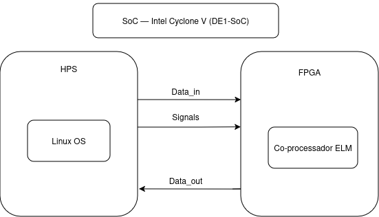
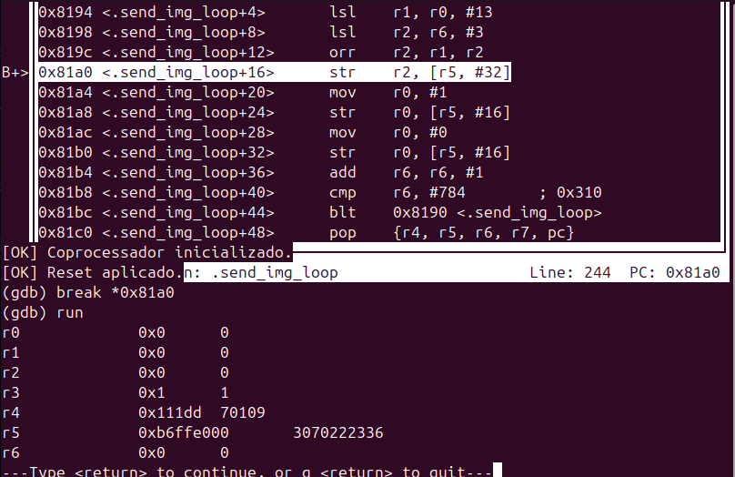

# FPGA-ELM-Linux-Driver
### MI - Sistemas Digitais (PBL)
## Sumário

- [Introdução](#introdução)
- [Fundamentação Teórica](#fundamentação-teórica)
  - [FPGA e HPS](#fpga-e-hps)
  - [MMIO](#mmio)
  - [Assembly ARM](#assembly-arm)
  - [Driver Linux](#driver-linux)
- [Requisitos Principais](#requisitos-principais)
  - [Entrada e Saída](#entrada-e-saída)
  - [Driver](#driver)
  - [Aplicação C](#aplicação-c)
- [Co-processador ELM](#co-processador-elm)
  - [Unidade de Controle](#unidade-de-controle)
  - [Unidade de Inferência](#unidade-de-inferência)
  - [Load/Store Unit](#loadstore-unit)
  - [Conjunto de Instruções](#conjunto-de-instruções)
  - [Fluxo de Execução](#fluxo-de-execução)
- [Metodologia de Desenvolvimento](#metodologia-de-desenvolvimento)
- [Descrição da Solução](#descrição-da-solução)
  - [Driver Assembly (funcoes.s)](#driver-assembly-funcoess)
  - [Aplicação C (main.c)](#aplicação-c-mainc)
  - [Integração C e Assembly](#integração-c-e-assembly)
- [Testes e Validação](#testes-e-validação)
  - [Metodologia de Testes](#metodologia-de-testes)
  - [Depuração com GDB](#depuração-com-gdb)
  - [Resultados](#resultados)
- [Modo de Uso](#modo-de-uso)
- [Conclusão](#conclusão)
  - [Pontos de Melhoria](#pontos-de-melhoria)
- [Referências](#referências)

## Introdução
Este relatório descreve o desenvolvimento do Marco 2 de um sistema embarcado voltado para a classificação de imagens de dígitos numéricos, com foco na integração entre o HPS e a FPGA da plataforma DE1-SoC e no desenvolvimento do driver Linux em Assembly ARM responsável por controlar o co-processador ELM via MMIO.

O problema proposto consiste em construir um classificador capaz de receber uma imagem 28×28 pixels em escala de cinza no formato PNG, processá-la através de uma rede neural ELM implementada no co-processador em FPGA, e retornar o dígito previsto entre 0 e 9. O co-processador responsável por executar essa inferência foi desenvolvido no Marco 1 e herdado pelo nosso grupo como base para esta etapa.

Foram desenvolvidos: a integração do co-processador ao projeto Quartus com mapeamento via ponte Lightweight HPS-to-FPGA, um driver Linux em Assembly ARM para controle do hardware via MMIO, e uma aplicação em C capaz de receber uma imagem PNG, acionar o driver e imprimir o dígito classificado. O relatório detalha cada uma dessas etapas, incluindo a arquitetura da solução, os testes realizados e os resultados obtidos.
Por fim, agradecemos ao monitor Maike de Oliveira Nascimento pela disponibilização do co-processador ELM desenvolvido no Marco 1, cujo trabalho foi essencial para o avanço desta etapa.

## Fundamentação Teórica
Esta seção apresenta os principais conceitos teóricos que embasam o desenvolvimento do Marco 2. Os tópicos foram selecionados por serem diretamente aplicados na implementação do driver em Assembly ARM e na integração entre o HPS e a FPGA, sendo essenciais para compreender as decisões de projeto adotadas pela equipe ao longo do desenvolvimento.

### FPGA e HPS 
A plataforma DE1-SoC é baseada em um SoC (System on Chip) da Intel que combina dois elementos principais em um único chip: um processador ARM Cortex-A9 de dois núcleos, chamado de HPS (Hard Processor System), e uma FPGA (Field Programmable Gate Array) da família Cyclone V.

O HPS é responsável por executar o sistema operacional Linux e as aplicações de software, enquanto a FPGA é utilizada para implementar circuitos digitais customizados em hardware, como o co-processador ELM desenvolvido no Marco 1. Essa combinação permite que tarefas computacionalmente intensivas sejam aceleradas em hardware, enquanto o controle e a interface com o usuário ficam a cargo do processador.

A comunicação entre o HPS e a FPGA é feita através de pontes dedicadas. No caso deste projeto, foi utilizada a ponte Lightweight HPS-to-FPGA, que permite ao processador acessar registradores e módulos implementados na FPGA como se fossem posições de memória, por meio do mecanismo de MMIO. A Figura 1 ilustra a arquitetura da solução desenvolvida, apresentando as três camadas do sistema e os mecanismos de comunicação entre elas. 

*Figura 1: Arquitetura da Solução*

### MMIO
MMIO (Memory-Mapped I/O) é uma tecnica que permite ao processador se comunicar com dispositivos de hardware acessando endereços de memória específicos. Em vez de utilizar instruções dedicadas de I/O, o processador simplesmente lê e escreve nesses endereços como se fossem posições normais de memória RAM, e o hardware responde a essas operações.

Na DE1-SoC, os registradores do co-processador implementado na FPGA são mapeados em endereços físicos acessíveis pelo HPS através da ponte Lightweight HPS-to-FPGA, a partir do endereço base 0xFF200000. Para acessar esses endereços a partir de um programa rodando no Linux, é necessário abrir o arquivo especial /dev/mem e utilizar a syscall mmap para mapear a região física para um endereço virtual acessível pelo processo, mecanismo que foi utilizado diretamente no driver desenvolvido pela equipe.

### Assembly ARM
Assembly ARM é a linguagem de programação de baixo nível que permite escrever instruções diretamente executáveis pelo processador ARM. No contexto deste projeto, foi utilizada a arquitetura ARMv7, presente no processador da plataforma DE1-SoC. Diferente de linguagens de alto nível, o Assembly oferece controle total sobre os registradores e a memória do processador, sendo frequentemente utilizado em situações onde desempenho e acesso direto ao hardware são necessários, como na implementação de drivers.

O processador ARM organiza seu estado interno em registradores de uso geral, sendo os principais r0 a r12, além do SP (stack pointer), LR (link register) e PC (program counter). A convenção de chamada AAPCS define regras para passagem de argumentos, retorno de valores e preservação de registradores entre funções, permitindo que código Assembly e código C coexistam no mesmo projeto. A comunicação com o sistema operacional é feita através de syscalls, instruções especiais que solicitam serviços ao kernel como abertura de arquivos e mapeamento de memória.

### Driver Linux
Um driver Linux é um componente de software responsável por fazer a interface entre o sistema operacional e um dispositivo de hardware. Ele abstrai os detalhes de baixo nível do hardware, expondo uma API que permite às aplicações interagir com o dispositivo de forma padronizada, sem precisar conhecer os detalhes internos de seu funcionamento.

No contexto deste projeto, o driver atua como intermediário entre a aplicação em C e o co-processador ELM implementado na FPGA, sendo responsável por inicializar o hardware, transferir os dados necessários para a inferência e retornar o resultado da classificação para a aplicação.

## Requisitos Principais
Esta seção descreve os requisitos que a solução deve atender, tanto os definidos explicitamente pelo enunciado quanto os identificados pela equipe ao longo do desenvolvimento. Para o Marco 2, o desafio central é garantir que o co-processador ELM desenvolvido no Marco 1 seja corretamente integrado ao HPS, controlado via MMIO através de um driver em Assembly ARM, e acessível por uma aplicação em C que permita ao usuário classificar imagens de dígitos numéricos de ponta a ponta.

### Entrada e Saída
A entrada do sistema é uma imagem em escala de cinza com 28×28 pixels, 8 bits por pixel, no formato PNG, totalizando 784 bytes. Cada pixel representa a intensidade luminosa de um ponto da imagem, variando de 0 (preto) a 255 (branco). Cada imagem representa um único dígito numérico entre 0 e 9.

Antes de ser enviada ao co-processador, a imagem é lida pela aplicação C, que extrai os 784 bytes de pixels e os repassa ao driver em Assembly, responsável por transferi-los ao hardware via MMIO.

A saída esperada é um número inteiro no intervalo [0, 9] correspondente ao dígito classificado pelo co-processador ELM, obtido através da operação argmax aplicada ao vetor de saída da rede neural.

### Driver
O driver deve ser implementado em Assembly ARM e atuar como interface entre a aplicação C e o co-processador ELM via MMIO, expondo uma API que permita à aplicação inicializar o hardware, enviar a imagem, os pesos e o bias, iniciar a inferência, aguardar a finalização via polling e retornar o resultado da classificação. Alem disso, deve garantir a correta sincronização entre o HPS e a FPGA, assegurando que os dados sejam transferidos na ordem correta e que o co-processador esteja pronto antes de cada operação.

### Aplicação C
A aplicação em C deve servir como interface entre o usuário e o sistema, sendo responsável por receber o caminho de uma imagem PNG via linha de comando, realizar a leitura e extração dos pixels e acionar o driver para que o processo de classificação seja iniciado. Após obter o resultado, a aplicação deve imprimir o dígito previsto na tela de forma clara ao usuário.

## Co-processador ELM
Esta seção é dedicada exclusivamente a descrever o funcionamento do co-processador ELM desenvolvido pelo monitor Maike de Oliveira Nascimento no Marco 1, cujo hardware foi utilizado como base para o desenvolvimento desta etapa.

O co-processador é composto por três módulos principais: a Unidade de Controle, a Unidade de Inferência e a Load/Store Unit. Cada um desses módulos possui responsabilidades e barramentos bem definidos.

### Unidade de Controle
A Unidade de Controle é responsável por receber as instruções e sinais de controle externos, realizar a decodificação da instrução e direcionar o processador para um estado de memória ou de inferência. Durante a execução de uma instrução nenhuma outra pode ser executada, sendo necessário aguardar o término da operação atual antes de enviar uma nova.

### Unidade de Inferência
A Unidade de Inferência abriga os MACs e os bancos de registradores utilizados durante o processo de cálculo. É dividida em seis submódulos: Primeira Camada, responsável pelos cálculos da camada oculta do ELM; Banco de 128 Registradores, que armazena os resultados dos neurônios da camada oculta; Segunda Camada, responsável pelos cálculos da camada de saída; Banco de 10 Registradores, que armazena os resultados dos neurônios da camada de saída; Argmax Iterativo, que busca o registrador de maior valor para determinar o dígito classificado; e a Unidade de Controle de Inferência, que organiza a execução de cada etapa da ELM.

### Load/Store Unit
A Load/Store Unit gerencia as operações de leitura e escrita de memória, implementando quatro instâncias de memória RAM de duas portas: mem_img, que armazena os 784 pixels da imagem; mem_win, que armazena os 100352 pesos da camada oculta; mem_bias, que armazena os 128 valores de bias; e mem_beta, que armazena os 1280 valores de beta da camada de saída.

### Conjunto de instruções
Em relação ao conjunto de instruções, o co-processador implementa sete instruções de 32 bits: Store Image (opcode 000),Store Weights Addr (001), Store Weights Value (010), Store Bias (011), Store Beta (100), Start (101) e Status (110). Vale destacar que a instrução Status não é utilizada na prática, pois tanto o resultado quanto as flags são atualizados diretamente no barramento de saída sem necessidade de solicitação. A comunicação com o co-processador é feita através de três barramentos: Data In (32 bits), utilizado para envio das instruções; Signals (3 bits), utilizado para envio de sinais de controle como Enable, Clear Operation e Reset; e Data Out (32 bits), que retorna o resultado da inferência e as flags de Done, Busy e Error.

### Fluxo de execução
O fluxo de execução do co-processador segue uma sequência bem definida: primeiro os dados são carregados nas memórias via instruções de memória (Store Image, Store Weights, Store Bias e Store Beta), em seguida a instrução Start dispara o processo de inferência, que percorre a camada oculta, aplica a função de ativação tanh, processa a camada de saída e por fim executa o argmax para determinar o dígito classificado. O resultado fica disponível no barramento Data Out junto com a flag de Done indicando a conclusão da operação.

## Metodologia de Desenvolvimento
Este projeto foi desenvolvido por meio da metodologia PBL (Problem Based Learning), em que o aprendizado é conduzido a partir de um problema real proposto pelo professor. As atividades são organizadas em sessões tutoriais, onde o grupo assume cargos definidos e cumpre metas estabelecidas para aquela etapa, e sessões de desenvolvimento, onde a equipe trabalha na implementação da solução. Dentro dessa metodologia, os roteiros de laboratório são materiais produzidos pelos professores com o objetivo de auxiliar o grupo na compreensão de etapas específicas do desenvolvimento, guiando o estudante passo a passo por conceitos e ferramentas relevantes para o projeto.

Os roteiros disponibilizados ao longo do processo foram fundamentais para guiar a equipe nas etapas iniciais do desenvolvimento, avançando de forma incremental a cada sessão tutorial.

O Lab 0 foi relevante para familiarizar a equipe com o ambiente de desenvolvimento, auxiliando nos primeiros contatos com o uso do terminal, a conexão com a placa DE1-SoC e aspectos básicos do fluxo de trabalho que seriam utilizados ao longo do projeto.

O Lab 2 foi o mais diretamente aplicável ao desenvolvimento do Marco 2. Por meio dele, a equipe compreendeu como funciona a integração entre o HPS e a FPGA, especialmente como abrir o projeto base no Quartus, visualizar o HPS e instanciar um módulo no top level do projeto, processo essencial para integrar o co-processador de Maike ao sistema. Essa compreensão orientou diretamente as decisões tomadas na etapa de integração HPS-FPGA.

No decorrer das sessões, a equipe decidiu por conta própria elaborar um fluxo de informações inicial, que serviu como base conceitual para o entendimento do sistema, sem ainda definir as instruções de forma concreta. Paralelamente, foram realizadas pesquisas sobre temas como polling, MMIO, como estruturar uma API em Assembly e outros conceitos relacionados, que trouxeram mudanças significativas na compreensão teórica da equipe e orientaram as decisões de implementação ao longo do desenvolvimento.

No desenvolvimento do driver, a equipe optou por implementar diretamente em Assembly ARM, sem passar por uma versão intermediária em C. Para garantir a corretude da implementação, foi utilizado o GDB como ferramenta de depuração, permitindo inspecionar o estado de cada registrador em tempo real a cada etapa da execução. A integração no Quartus foi realizada com base no aprendizado do Lab 2, seguindo o mesmo processo de construção do top level para instanciar o co-processador no projeto base.

## Descrição da Solução
A solução desenvolvida é composta por três camadas que trabalham em conjunto: o driver em Assembly ARM, a aplicação em C e o header de integração entre os dois. O driver é responsável por toda a comunicação de baixo nível com o co-processador via MMIO, expondo uma API que a aplicação C utiliza para orquestrar o fluxo completo de classificação. A comunicação entre as camadas é feita através do arquivo funcoes.h, que declara os protótipos das funções Assembly para o compilador C, permitindo a link-edição dos dois módulos em um único executável.A Figura 2 apresenta a organização interna da plataforma DE1-SoC, destacando a comunicação entre o HPS e o co-processador ELM implementado na FPGA através dos barramentos Data_in, Signals e Data_out.

*Figura 2: Diagrama de comunicação HPS e coprocessador*

### Driver Assembly (funcoes.s)

O driver foi implementado inteiramente em Assembly ARM e organiza suas funções em torno de três PIOs mapeados a partir do endereço base 0xFF200000: pio_data_out (offset 0x00), utilizado para leitura do resultado e flags; pio_signals (offset 0x10), utilizado para envio de sinais de controle como enable, reset e clear; e pio_data_in (offset 0x20), utilizado para envio das instruções ao co-processador. A Figura 3 apresenta o mapeamento dos PIOs no Platform Designer, confirmando os endereços base utilizados pelo driver para acessar os registradores do co-processador via MMIO.

*Figura 3: Mapeamento dos PIOs no Platform Designer*

A função "iniciar" abre o arquivo "/dev/mem" via syscall "open" e mapeia a região física da ponte Lightweight HPS-to-FPGA para um endereço virtual acessível pelo processo, utilizando a syscall "mmap2". O endereço virtual retornado é salvo em "FPGA_BASE" e utilizado por todas as demais funções. Ao final, "fechar" desfaz esse mapeamento via "munmap" e fecha o file descriptor.

As funções "resetar" e "limpar" enviam pulsos nos bits 2 e 1 do "pio_signals", respectivamente, garantindo que o co-processador esteja em estado IDLE antes de cada inferência.

As funções de envio de dados "send_image", "send_weights", "send_bias" e "send_beta" montam as instruções seguindo o formato da ISA do co-processador, posicionando o opcode nos bits [2:0], o endereço e o dado nos campos correspondentes via deslocamentos e operações de OR, e então escrevem a instrução no "pio_data_in" seguida de um pulso de enable. Os pesos são enviados em dois ciclos por valor: primeiro a instrução de endereço (opcode 001) e em seguida a instrução de valor (opcode 010). Os valores de bias, beta e weights são representados em ponto fixo Q4.12 e passam por "rev16" para correção de endianness antes do envio.

Durante o desenvolvimento do driver, foi necessário considerar o formato de endianness utilizado pelo processador ARM da plataforma DE1-SoC. O ARM Cortex-A9 opera naturalmente em modo little endian, ou seja, o byte menos significativo é armazenado no menor endereço de memória.

No envio dos valores de bias, beta e weights para o coprocessador, observou-se a necessidade de reorganizar os bytes dos dados de 16 bits antes da transmissão. Para isso, foi utilizada a instrução rev16, responsável por inverter a ordem dos bytes dentro de cada halfword de 16 bits.

Essa conversão foi necessária para garantir que os valores em ponto fixo Q4.12 fossem interpretados corretamente pelo hardware durante o processo de inferência. Sem essa correção, os bytes seriam lidos em ordem incorreta, comprometendo os resultados produzidos pelo co-processador.

Dessa forma, o driver garante que os dados enviados ao hardware estejam organizados na ordem esperada pelo co-processador, assegurando a correta interpretação dos valores durante as operações de leitura e escrita realizadas via MMIO.

A função "send_start" envia apenas o opcode 101 ao co-processador, disparando o início da inferência. Em seguida, "polling" fica em loop lendo o "pio_data_out" até que o bit 4 (Done) seja 1, indicando que o co-processador concluiu. Por fim, "ler_resultado" isola os bits [3:0] do "pio_data_out", que contêm o dígito predito entre 0 e 9.

*Figura 4: Fluxo de execução do driver*

### Aplicação C (main.c)

A aplicação em C atua como interface entre o usuário e o driver,oferecendo um menu interativo com 14 opções que permitem executar cada etapa do fluxo individualmente, de forma manual, ou de forma automática através da opção de inferência completa. No modo manual, o usuário pode enviar cada dado separadamente, inicializando o hardware, carregando e enviando a imagem, os pesos, o bias e o beta em etapas distintas, e por fim iniciando a inferência e lendo o resultado.

A função "inferencia_completa" encapsula todo o fluxo em sequência: inicializa o hardware caso ainda não tenha sido feito, aplica reset e clear, carrega e envia a imagem, os pesos, o bias e o beta, dispara a inferência via "send_start", aguarda o resultado via "polling" e imprime o dígito predito na tela. O carregamento dos arquivos binários é feito pela função auxiliar "carregar_arquivo", que abre o arquivo, lê exatamente o número de bytes esperado e fecha o arquivo, retornando erro caso a leitura seja incompleta.

A aplicação controla o estado do sistema através de flags internas, evitando operações indevidas como enviar dados sem o hardware inicializado.

### Integração C e Assembly

A integração entre a aplicação C e o driver Assembly é feita através do arquivo "funcoes.h", que declara os protótipos de todas as funções exportadas pelo driver. O arquivo Assembly exporta cada função com ".global" e ".type", tornando os símbolos visíveis ao linker. A compilação é feita separadamente com "gcc -marm -c", gerando os arquivos objeto "main.o" e "funcoes.o", que são então linkados em um único executável pelo comando "gcc -marm main.o funcoes.o -o exe". A convenção de chamada AAPCS é respeitada em todas as funções do driver, garantindo compatibilidade com o código C.

Todo esse processo é automatizado pelo Makefile, que define quatro regras principais: "build", que compila os módulos C e Assembly separadamente e os linka em um único executável; "run", que executa o programa com "sudo"; "test", que executa o script de testes batch; e "clean", que remove os arquivos gerados pela compilação. Dessa forma, o desenvolvedor não precisa executar os comandos de compilação manualmente a cada alteração no código.

## Testes e Validação
Esta seção descreve o processo de testes realizado pela equipe para validar o funcionamento do sistema, abrangendo tanto a depuração do driver em Assembl durante o desenvolvimento quanto a validação final por meio de um conjunto de imagens de dígitos numéricos.

### Metodologia de Testes

Os testes foram realizados por meio de um script batch (teste_batch.sh), executado via make test. O script compila o projeto automaticamente, percorre um diretório com 100 imagens organizadas em subpastas por dígito, sendo 10 imagens de cada dígito de 0 a 9, executa o classificador para cada imagem e gera um relatório final em resultados.txt com o resultado de cada classificação e a acurácia geral do sistema.

O fluxo do script consiste em montar uma sequência de inputs simulando a interação com o menu da aplicação, executar o programa uma única vez com todos os inputs via redirecionamento, extrair as predições da saída e comparar com os valores esperados.

### Depuração com GDB

Durante o desenvolvimento do driver, o GDB foi utilizado como ferramenta de depuração para validar o comportamento do código Assembly em tempo de execução. Como o driver é implementado diretamente em Assembly ARM, qualquer erro em um registrador pode quebrar o fluxo silenciosamente, sem mensagens de erro visíveis. O GDB permitiu que a equipe inspecionasse o estado dos registradores a cada etapa, verificando se o valor montado da instrução estava correto antes de ser enviado ao co-processador via pio_data_in,se o mmap retornou um endereço virtual válido para a ponte LW, e se o polling estava testando o bit correto do pio_data_out para detectar o sinal de Done.A Figura 5 ilustra o uso do GDB durante a depuração do driver, mostrando o estado dos registradores no loop de envio da imagem.

*Figura 5: Uso do GDB durante a depuração do driver*

### Resultados

O sistema classificou corretamente 83 das 100 imagens testadas, atingindo uma acurácia de 83%. O relatório gerado pelo script detalha os acertos e erros por dígito, permitindo identificar quais classes apresentaram maior dificuldade de classificação. O resultado demonstra que a comunicação entre o HPS e o co-processador ELM foi estabelecida com sucesso e que o fluxo completo de inferência, desde o envio da imagem até a leitura do dígito predito, funcionou de forma estável ao longo de todos os testes realizados.

## Modo de Uso
O projeto utiliza um Makefile para automatizar o processo de compilação e execução. Para compilar, basta executar make build, que compila separadamente o módulo C e o módulo Assembly e os linka em um único executável chamado exe. Para executar o programa, o comando make run já cuida de rodar o executável com sudo, necessário para acessar o /dev/mem e realizar o mapeamento de memória da FPGA.

Caso queira limpar os arquivos gerados pela compilação, make clean remove os objetos e o executável.
Para rodar os testes com as 100 imagens, o comando make test executa o script teste_batch.sh, que automatiza todo o processo de classificação e gera um relatório detalhado em resultados.txt com os acertos, erros e a acurácia final do sistema.

Ao executar o programa, um menu interativo é exibido com 14 opções que permitem controlar cada etapa do fluxo individualmente, desde a inicialização do hardware até a leitura do resultado. O usuário pode optar por executar a inferência de forma automática, selecionando a opção 1, que orquestra todo o fluxo em sequência e imprime o dígito predito na tela, ou de forma manual, enviando cada dado separadamente através das opções individuais do menu, o que permite maior controle sobre cada etapa do processo. Para alterar a imagem a ser classificada, a opção 13 solicita que o usuário informe o caminho completo do novo arquivo ".bin", substituindo o caminho anterior.

## Conclusão
O desenvolvimento do Marco 2 foi concluído com sucesso, atingindo todos os objetivos propostos pelo enunciado. A equipe realizou a integração do co-processador ELM ao projeto Quartus via ponte Lightweight HPS-to-FPGA e implementou o driver em Assembly ARM com uma API completa para controle do hardware via MMIO. Além do que foi requisitado, a equipe desenvolveu uma aplicação em C com menu interativo que vai além do escopo mínimo do Marco 2, oferecendo ao usuário controle granular sobre cada etapa do fluxo de classificação, tanto de forma automática quanto manual.

A validação do sistema foi realizada com 100 imagens, 10 de cada dígito, atingindo uma acurácia de 83%. O resultado demonstra que a solução desenvolvida é funcional e estável, cumprindo o requisito de classificar imagens repetidamente sem falhas de comunicação entre o HPS e a FPGA.

O projeto contribuiu significativamente para o aprendizado da equipe em áreas como programação em Assembly ARM, MMIO, integração HPS-FPGA e desenvolvimento de drivers Linux, consolidando na prática os conceitos trabalhados ao longo da disciplina por meio da metodologia PBL.

### Pontos de Melhoria

Um ponto de melhoria identificado diz respeito ao uso excessivo de syscalls diretas no driver em Assembly ARM. A cada operação realizada, o driver realiza chamadas diretas ao kernel, como "open", "mmap2", "read" e "close", o que representa uma transição constante entre o espaço de usuário e o espaço do kernel. Esse comportamento, além de impactar o desempenho, expõe o sistema a riscos desnecessários, pois o acesso direto à memória física via "/dev/mem" sem as proteções adequadas do sistema operacional pode comprometer a estabilidade do sistema.

## Referências
DEV TECH. Tutorial Makefile em C. YouTube, 2020. Disponível em: https://youtu.be/U6IfLZOh6Sc

MATOS, Kamilly. Coprocessador de Imagens PBL SD. GitHub, 2025. Disponível em: https://github.com/kamillymatos/coprocessador-de-imagens-pbl-sd-2

Um guia completo para o desenvolvimento de API. AppMaster. Disponível em: https://appmaster.io/pt/blog/um-guia-completo-para-o-desenvolvimento-da-api

NASCIMENTO, Maike. Problema SD 2026.1. GitHub, 2026. Disponível em: https://github.com/DestinyWolf/
Problema_SD_2026_1

The Linux man-pages project. mmap — map files or devices into memory. Disponível em: https://man7.org/linux/man-pages/man2/mmap.2.html
